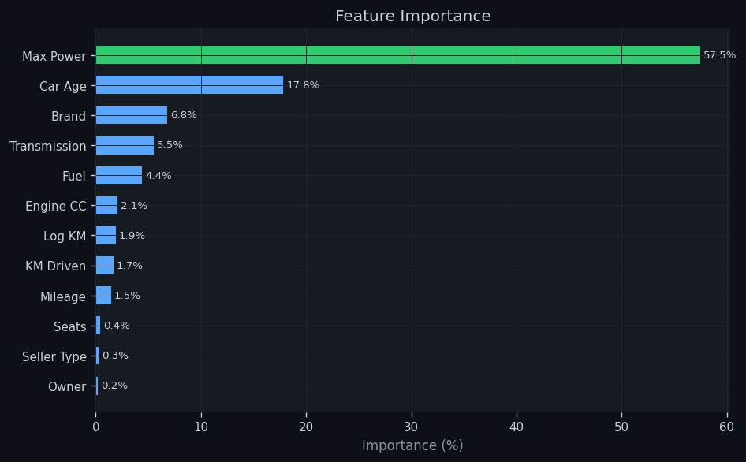
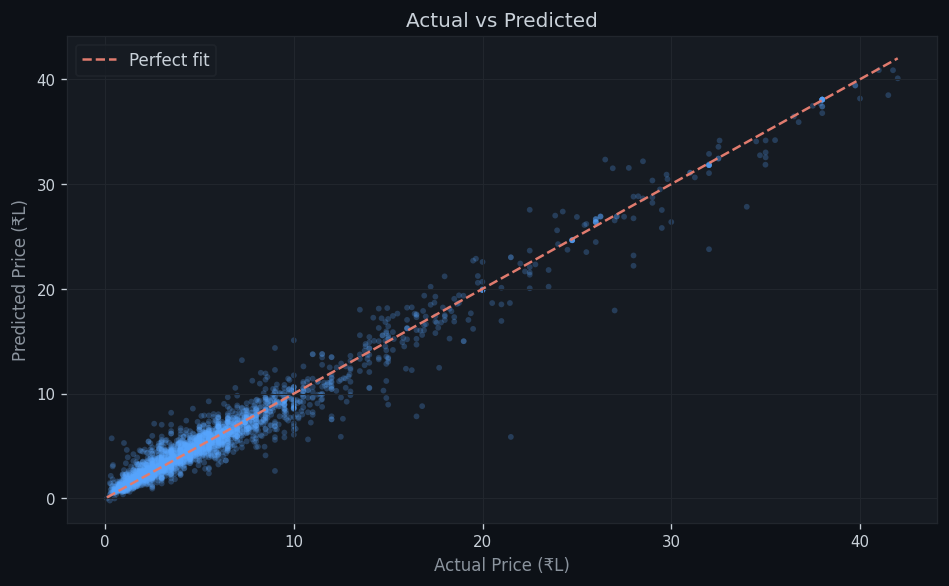
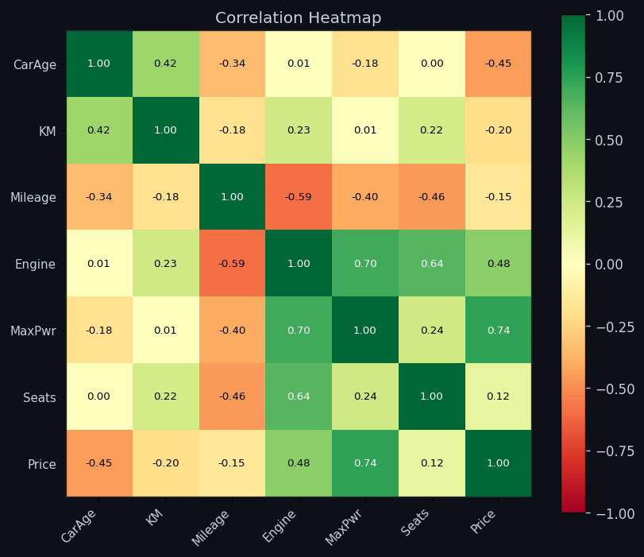
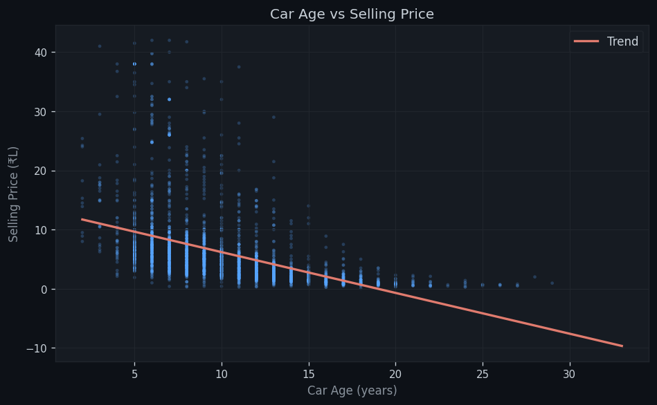
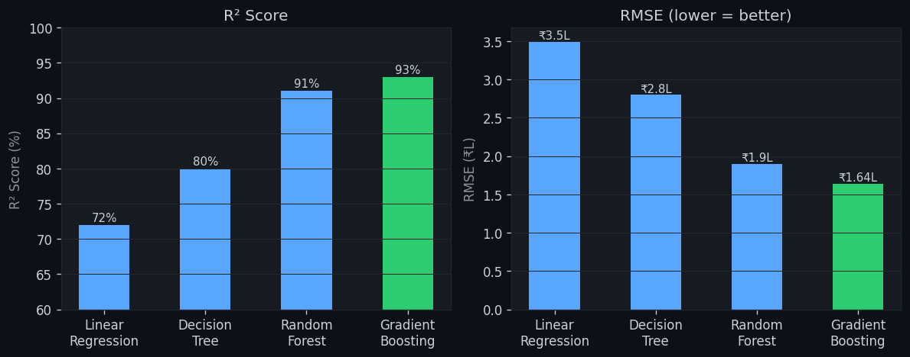

# PriceMyRide

A used car resale price predictor built with Python and Streamlit. Enter a car's details — brand, year, mileage, engine specs, ownership history, and the price it was originally bought for — and the app gives you an estimated resale value with a depreciation breakdown.

---

## What it does

You fill in the car details and hit **Predict Resale Price**. The app runs the data through a Gradient Boosting model and returns:

- Estimated resale price with a confidence range
- How much value the car has lost compared to its current price
- A depreciation rating (Good / Moderate / High)

---

## Tech stack

- **Frontend** — Streamlit
- **Model** — Gradient Boosting Regressor (scikit-learn)
- **Data** — 14,475 car listings from 4 Kaggle datasets
- **Language** — Python 3

---

## Project files

```
Day 3 project/
├── app.py               → main Streamlit application
├── train_model.py       → trains and benchmarks models, saves the best one
├── extract_metrics.py   → recomputes R² and RMSE from the saved model
├── generate_charts.py   → generates the evaluation chart images
├── model.pkl            → trained model + label encoders
├── meta.pkl             → dropdown options + accuracy metrics
├── requirements.txt
├── charts/              → evaluation chart images
└── data/             → raw CSV datasets
```

---

## Model

Trained a Gradient Boosting Regressor and benchmarked it against Linear Regression, Decision Tree, and Random Forest. GBR came out on top.

| Parameter        | Value |
|------------------|-------|
| Estimators       | 500   |
| Learning rate    | 0.05  |
| Max depth        | 6     |
| Subsample        | 0.85  |
| Train/test split | 80/20 |

---

## Results

| Metric         | Value     |
|----------------|-----------|
| R² Score       | 93.00%    |
| RMSE           | ₹1.64 L   |
| Training rows  | 14,475    |
| Features       | 12        |
| Brands covered | 80+       |

---

## Model comparison

| Model                     | R²    | RMSE    |
|---------------------------|-------|---------|
| Linear Regression         | ~72%  | ~₹3.5L  |
| Decision Tree             | ~80%  | ~₹2.8L  |
| Random Forest             | ~91%  | ~₹1.9L  |
| **Gradient Boosting** ✅  | **93%** | **₹1.64L** |

---

## Features used

| Feature       | What it is                                     |
|---------------|------------------------------------------------|
| car_age       | 2024 minus the year of manufacture             |
| km_driven     | odometer reading                               |
| log_km        | log-transformed km (handles mileage outliers)  |
| fuel          | Petrol / Diesel / CNG / LPG / Electric         |
| transmission  | Manual or Automatic                            |
| owner         | First, Second, Third owner, etc.               |
| seller_type   | Individual or Dealer                           |
| brand         | Manufacturer                                   |
| mileage_kmpl  | Fuel efficiency                                |
| engine_cc     | Engine displacement                            |
| max_power_bhp | Peak power output                              |
| seats         | Seating capacity                               |

---

## Evaluation charts

### Feature Importance

Max Power and Engine CC turned out to be the most influential features, which makes intuitive sense — powerful, larger-engine cars tend to hold value better.



---

### Actual vs Predicted

Points clustered tightly along the diagonal mean the model is predicting close to actual prices on unseen test data.



---

### Correlation Heatmap

Max Power and Engine CC are strongly correlated with price. Car Age has the expected negative correlation — older cars are cheaper.



---

### Car Age vs Selling Price

Clear depreciation trend across the dataset. The older the car, the lower the resale value on average.



---

### Model Comparison

GBR outperformed every other model on both R² and RMSE, which is why it was selected.



---

## Running it locally

```bash
pip install -r requirements.txt
streamlit run app.py
```

To retrain the model from scratch:

```bash
python train_model.py
```

---

## Data sources

| Dataset                            | Source      |
|------------------------------------|-------------|
| car data.csv                       | Kaggle V1   |
| CAR DETAILS FROM CAR DEKHO.csv     | CarDekho    |
| Car details v3.csv                 | CarDekho V3 |
| car details v4.csv                 | CarDekho V4 |

---
